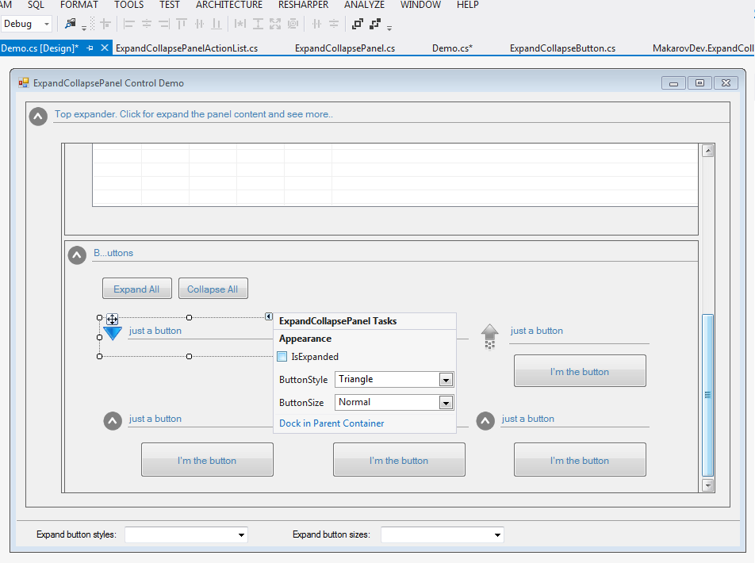
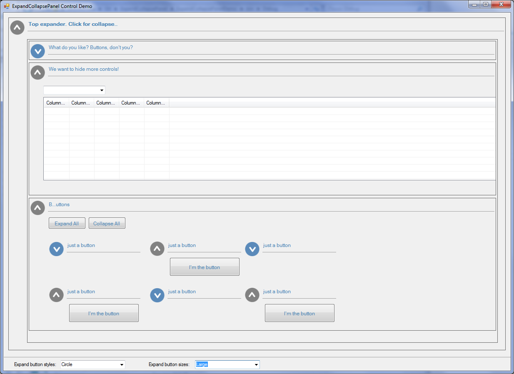
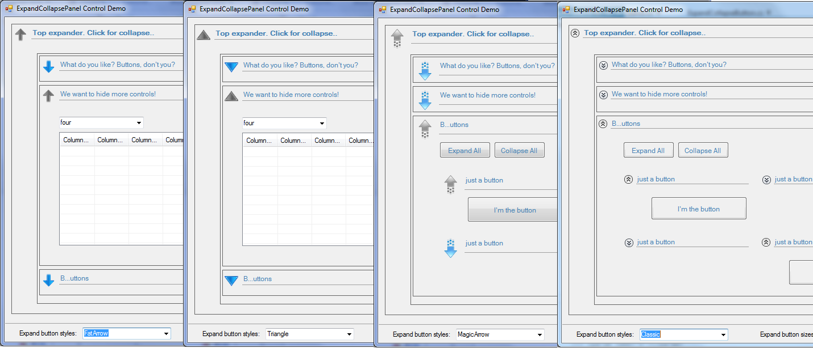

# ExpandCollapsePanel

ExpandCollapsePanel is WinForms control that provides similar UX to WPF Expander control. It displays a header that has a collapsible area with content. 

There are two projects, the first is the library itself and the second one is a demo application.

> [!TIP]
> ExpandCollapsePanel can be simply used from Form Designer window, you can add controls and expand or collapse panel with smart tags in designer mode directly.

> [!NOTE]
> The library is imperfect and incomplete in some respects. But in general, it must meet all the basic requirements for this kind of control as shown in the demo application. For all additional functionality, you can always edit implementation code, it shouldn't be difficult since it is well documented.

## Features:
### 1) Easy editing in Form Designer

### 2) Put any control that you want into the content region
 

### 3) Apply different styles and sizes
  